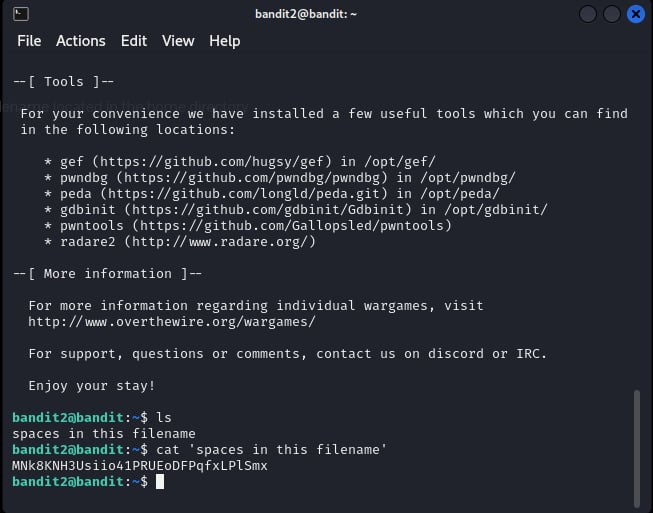

# Bandit Level 2

## Level Goal

The password for the next level is stored in a file called - located in the home directory

## Solution

## Helpful Reading Material

- [Google Search for “dashed filename”](https://www.google.com/search?q=dashed+filename)
- [Advanced Bash-scripting Guide - Chapter 3 - Special Characters](https://tldp.org/LDP/abs/html/special-chars.html)