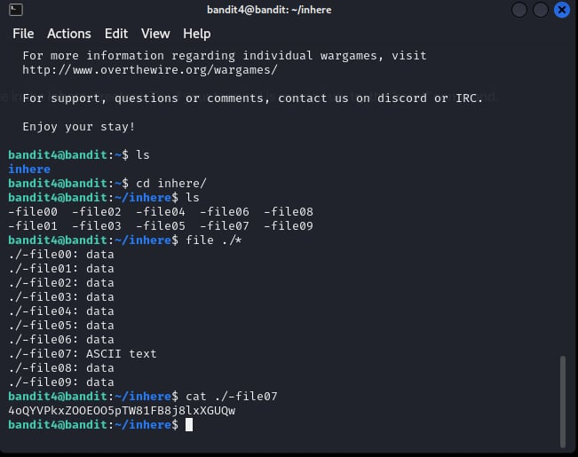

# Bandit Level 4

## Level Goal

The password for the next level is stored in the only human-readable file in the inhere directory. Tip: if your terminal is messed up, try the “reset” command.

## Solution

## Helpful Reading Material

- [Question about find comand and finding humand readable text in multiple directories and files](https://www.reddit.com/r/linuxquestions/comments/ku3agh/question_about_find_comand_and_finding_humand/)
- [UNIX commands - find](https://unix.stackexchange.com/questions/43148/unix-commands-find)