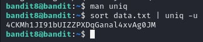

# Bandit Level 8

## Level Goal

The password for the next level is stored in the file data.txt and is the only line of text that occurs only once

## Solution

## References

- [Sorting a text file & removing duplicates](https://stackoverflow.com/questions/3188858/sorting-a-text-file-removing-duplicates)
- [Uniq Linux Command: Handling Duplicate Lines in Files](https://ioflood.com/blog/uniq-linux-command/#:~:text=The%20'uniq'%20command%20in%20Linux%20is%20a%20powerful%20tool%20used,%2C%20uniq%20%5Boption%5D%20sample_file.)